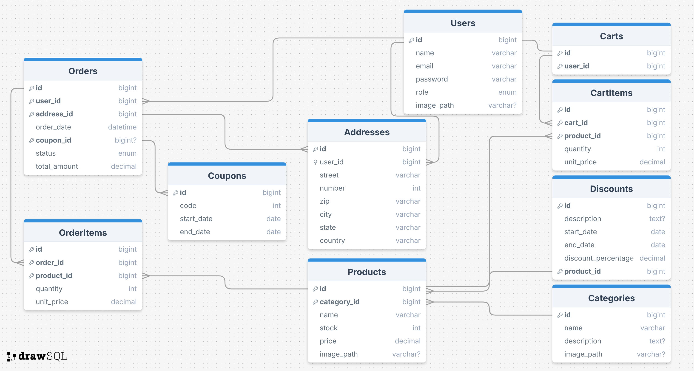

# Documentação Marketplace API  

Segue abaixo o esquema do banco de dados:




---
## Autenticação

### Registrar usuário
```http
POST /api/register
```
#### Não requer autenticação

| Parâmetro     | Tipo     | Descrição                     |
| :------------- | :------- | :------------------------------ |
| `name`         | `string` | **Obrigatório**. Nome do usuário   |
| `email`        | `string` | **Obrigatório**. Email válido       |
| `password`     | `string` | **Obrigatório**. Senha segura       |
| `password_confirmation` | `string` | **Obrigatório**. Confirmação da senha |

### Login
```http
POST /api/login
```
#### Não requer autenticação


| Parâmetro     | Tipo     | Descrição                     |
| :------------- | :------- | :------------------------------ |
| `email`        | `string` | **Obrigatório**. Email cadastrado   |
| `password`     | `string` | **Obrigatório**. Senha              |


### Verificação de email
```http
GET /api/email/verify/{id}/{hash}
```
#### Requer autenticação(token)


| Parâmetro | Tipo     | Descrição                    |
| :-------- | :------- | :------------------------- |
| `id`      | `int`    | ID do usuário               |
| `hash`    | `string` | Hash de verificação         |

### Reenviar email de verificação
```http
POST /api/email/verification-notification
```
#### Requer autenticação(token)


### Enviar email de recuperação de senha
```http
POST /api/password/forgot-password
```
#### Requer autenticação(token)

| Parâmetro     | Tipo     | Descrição                     |
| :------------- | :------- | :------------------------------ |
| `email`        | `string` | **Obrigatório**.


### Validar token de recuperação de senha
```http
POST /api/password/reset-password
```
#### Requer autenticação(token)

| Parâmetro     | Tipo     | Descrição                     |
| :------------- | :------- | :------------------------------ |
| `token`        | `string` | **Obrigatório**.|
| `email`        | `string` | **Obrigatório**.|
| `password`     | `string` | **Obrigatório**.|
| `password_confirmation` | `string` | **Obrigatório**.|

---

## Categorias


### Listar todas categorias
```http
GET /api/categories
```
#### Não requer autenticação
#### Retorna
```json
[
    {
        "id": 1,
        "name": "Bebê",
        "description": "Bebê de laranja",
        "image_path": "public/categories/1.jpg"
    },
    {
        "id": 2,
        "name": "Sala",
        "description": "Sala de verde",
        "image_path": "public/categories/2.jpg"
    }
]
```

Para obter os produtos relacionados as categorias, basta utilizar o "include" no endpoint.

```http
GET /api/categories?include=products
```
#### Retorna
```json
{
    "data": [
        {
            "id": 1,
            "name": "Casacos",
            "description": "Todos os tipos de casaco",
            "image_path": "public/categories/1.jpg",
            "products": [
                {
                    "id": 1,
                    "name": "Casaco de lã",
                    "description": "...",
                    "image_path": "public/products/1.jpg",
                    "stock": 10,
                    "price": 100,
                    "category_id": 1
                },
                {
                    "id": 2,
                    "name": "Casaco de couro",
                    "description": "...",
                    "image_path": "public/products/2.jpg",
                    "stock": 10,
                    "price": 100,
                    "category_id": 1
                }
            ],
        }
    ]
}
```

### Retornar apenas uma categoria
```http
GET /api/categories/{id}
```
#### Não requer autenticação

| Parâmetro | Tipo     | Descrição                    |
| :-------- | :------- | :------------------------- |
| `id`      | `int`    | ID da categoria             |

#### Retorna
```json
{
    "id": 1,
    "name": "Casacos",
    "description": "Todos os tipos de casaco",
    "image_path": "public/categories/1.jpg"
}
```

Pode obter os produtos relacionados a uma categoria, basta utilizar o "include" no endpoint.

```http
GET /api/categories/{id}?include=products
```
#### Retorna
```json
{
    "id": 1,
    "name": "Casacos",
    "description": "Todos os tipos de casaco",
    "image_path": "public/categories/1.jpg",
    "products": [
        {
            "id": 1,
            "name": "Casaco de lã",
            "description": "...",
            "image_path": "public/products/1.jpg",
            "stock": 10,
            "price": 100,
            "category_id": 1
        }
    ]
}
```

### Criar uma categoria
```http
POST /api/categories
```
#### Requer autenticação (ADMIN)

| Parâmetro     | Tipo     | Descrição                     |
| :------------- | :------- | :------------------------------ |
| `name`         | `string` | **Obrigatório**.
| `description`  | `string` | **Não obrigatório**.


### Atualizar uma categoria
```http
PUT /api/categories/{id}
```
#### Requer autenticação (ADMIN)

| Parâmetro     | Tipo     | Descrição                     |
| :------------- | :------- | :------------------------------ |
| `id`           | `int`    | **Obrigatório**.
| `name`         | `string` | **Obrigatório**.
| `description`  | `string` | **Não obrigatório**.

### Deletar uma categoria
```http
DELETE /api/categories/{id}
```
#### Requer autenticação (ADMIN)

| Parâmetro | Tipo     | Descrição                    |
| :-------- | :------- | :------------------------- |
| `id`      | `int`    | **Obrigatório**.
---

## Produtos

### Listar todos os produtos
```http
GET /api/products
```
#### Não requer autenticação
#### Retorna
```json
[
    {
        "id": 1,
        "name": "Casaco de lã",
        "description": "Casaco de laranja",
        "image_path": "public/products/1.jpg",
        "stock": 10,
        "price": 100,
        "category_id": 1
    },
    ...
]
```

Pode obter todos os produtos com a categoria, e/ou com os descontos relacionados, basta utilizar o "include" no endpoint.

```http
GET /api/products?include=category,discounts
```
#### Retorna
```json
{
    "data": [
        {
            "id": 1,
            "category_id": 1,
            "name": "Casaco de lã",
            "description": "Casaco de laranja",
            "image_path": "public/products/1.jpg",
            "stock": 10,
            "price": 100,
            "category": {
                "id": 1,
                "name": "Casacos",
                "description": "Todos os tipos de casaco",
                "image_path": "public/categories/1.jpg"
            },
            "discounts": [
                {
                    "id": 1,
                    "description": "Desconto de R$ 10,00",
                    "discount_percentage": 10,
                    "start_date": "2021-01-01",
                    "end_date": "2021-12-31",
                    "product_id": 1
                }
            ]
        },
        ...
    ]
}
```

### Retornar apenas um produto
```http
GET /api/products/{id}
```
#### Não requer autenticação

| Parâmetro | Tipo     | Descrição                    |
| :-------- | :------- | :------------------------- |
| `id`      | `int`    | ID do produto               |

#### Retorna
```json
{
    "id": 1,
    "name": "Casaco de lã",
    "description": "Casaco de laranja",
    "image_path": "public/products/1.jpg",
    "stock": 10,
    "price": 100,
    "category_id": 1
}
```

Pode obter todos os produtos com a categoria, e/ou com os descontos relacionados, basta utilizar o "include" no endpoint.


### Criar um produto
```http
POST /api/products
```
#### Requer autenticação (MODERATOR)

| Parâmetro     | Tipo     | Descrição                     |
| :------------- | :------- | :------------------------------ |
| `name`         | `string` | **Obrigatório**.|
| `description`  | `string` | **Não obrigatório**.|
|`price`         | `number`    | **Obrigatório**.|
| `stock`        | `int`    | **Obrigatório**.|
| `category_id`  | `int`    | **Obrigatório**.|

### Atualizar um produto
```http
PUT /api/products/{id}
```
#### Requer autenticação (MODERATOR)

| Parâmetro     | Tipo     | Descrição                     |
| :------------- | :------- | :------------------------------ |
| `id`           | `int`    | **Obrigatório**.|
| `name`         | `string` | **Não obrigatório**.|
| `description`  | `string` | **Não obrigatório**.|
|`price`         | `number`    | **Não obrigatório**.|
| `category_id`  | `int`    | **Não obrigatório**.|

O estoque não é alterado por essa rota. Para alterar o estoque, utilize a rota de atualização de estoque.

### Atualizar estoque de um produto
```http
POST /api/products/{id}/stock
```
#### Requer autenticação (MODERATOR)

| Parâmetro     | Tipo     | Descrição                     |
| :------------- | :------- | :------------------------------ |
| `id`           | `int`    | **Obrigatório**.|
| `stock`        | `int`    | **Obrigatório**.|


### Atualizar imagem de um produto
```http
POST /api/products/image/{id}
```
#### Requer autenticação (MODERATOR)

| Parâmetro     | Tipo     | Descrição                     |
| :------------- | :------- | :------------------------------ |
| `id`           | `int`    | **Obrigatório**.|
| `image`        | `file` | **Obrigatório**.|


### Deletar um produto
```http
DELETE /api/products/{id}
```
#### Requer autenticação (ADMIN)

| Parâmetro | Tipo     | Descrição                    |
| :-------- | :------- | :------------------------- |
| `id`      | `int`    | **Obrigatório**.
---

